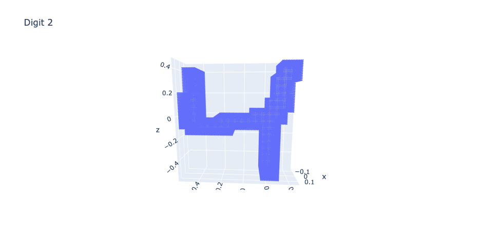
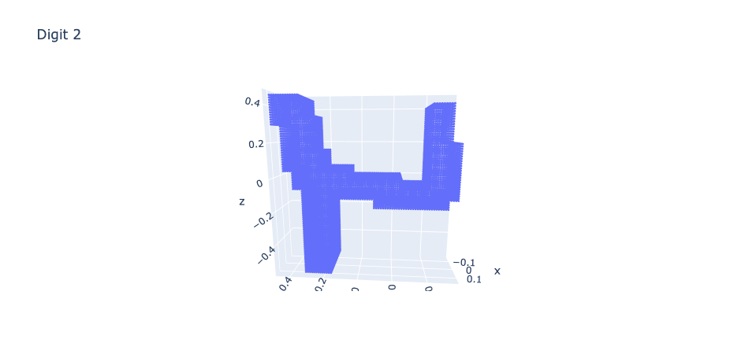
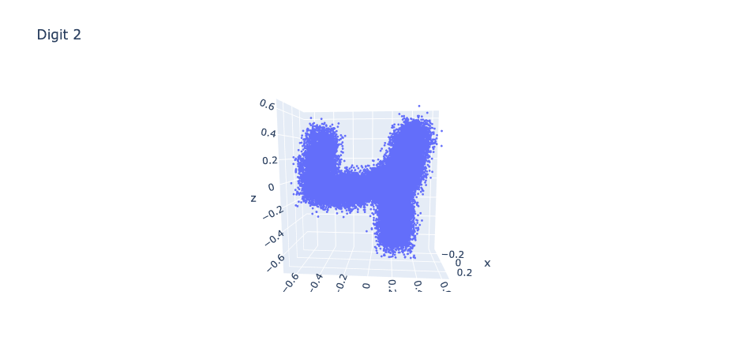
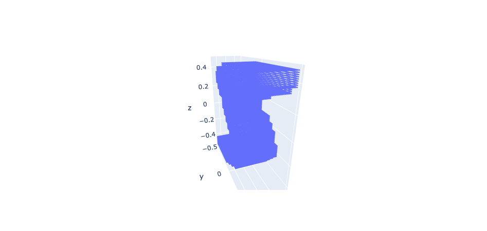
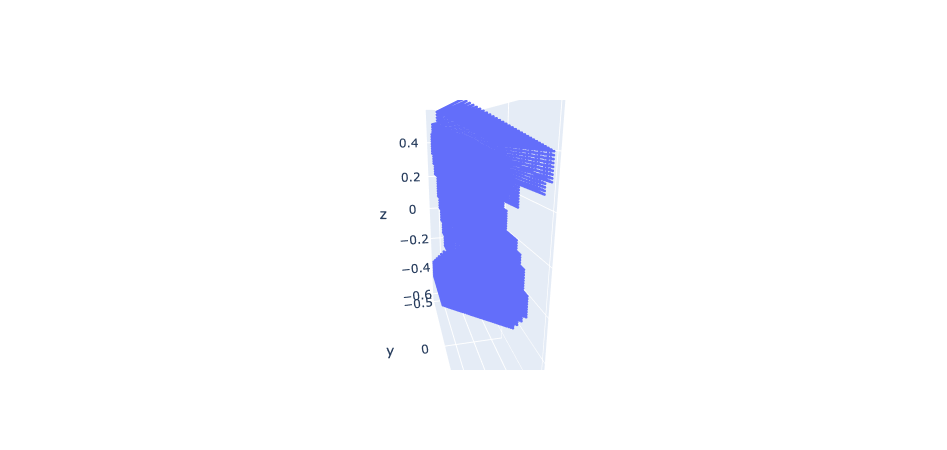
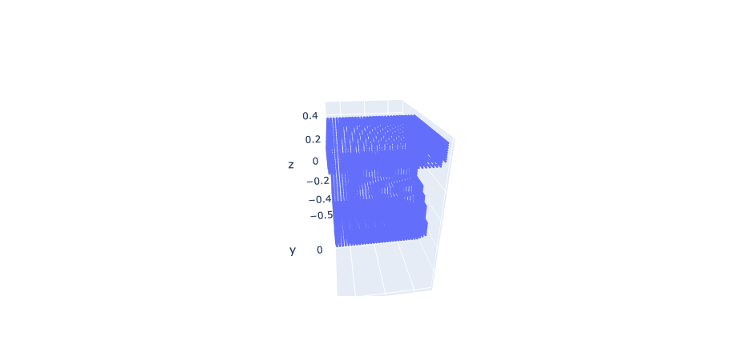

# 숫자 3D 이미지 분류 AI 경진대회

[대회 링크](https://dacon.io/competitions/official/235951/overview/description)

## 모델 구성

- 데이터 확인
  - save_fig.py를 이용해 test 데이터 사진 전부 확인

- 데이터 augment
  - rotation : -90 ~ 90도
  - flip : x, y, z축에 대해 flip   
  - noise : 좌표값에 가우시안 노이즈 추가  
  - shear : x, y, z 축에 대해 전단 추가 z축에 대해 원래 데이터 모습 z축에 대해 전단이 된 모습(평행사변형 처럼 틀어진 것을 확인)
  - scaling : x, y, z 축에 대해 스케일링 추가  x축에 대해 2배 스케일링 된 모습

- 데이터 선택
  - train-validation 분할 방법 : 앞쪽 80% 뒤쪽 20% --> random하게 80:20로 변경

- 모델
  - 컨볼루션 레이어 몇 개 더 추가
  - 컨볼루션 레이어에 Dropout 적용
  - FC 레이어 크기 증가 및 레이어 추가
  - FC 레이어에 Dropout 적용
  - STN 레이어 내부 크기 증가 및 레이어 추가

## 사용법

- train

```console
foo@bar:~$ python train.py --train_batch_size 16 --valid_batch_size 16 --epochs 100 --lr 5e-5
```

- make submission file

```console
foo@bar:~$ python inference.py --test_batch_size 16 --weight ./weights/best_model.pth
```

## 특이사항

- voxel 값을 cliping한 것과 normalize한 것을 학습한 결과 normalize한 것이 아예 학습이 잘 되지 않는 현상 발생 -> 너무 값이 작아져서 그런듯

## TODO

- STN 변환 결과 확인하기
